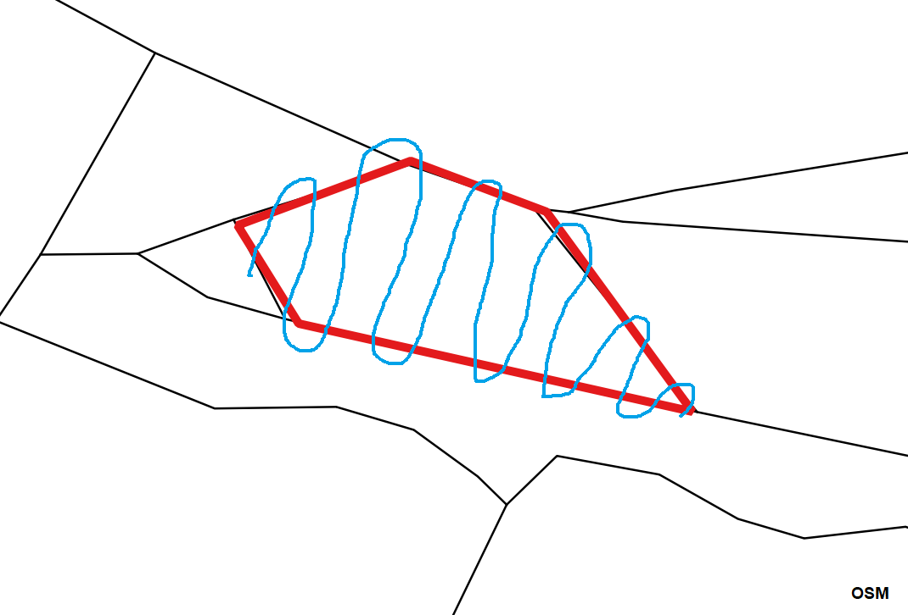

my_PathViewer_light

# Purpose
Very simple html file, based on OpenLayers library, that will show your position and path on Your own map.
It works offline, only GPS signal is required.

black - map_background.geojson; red - map_of_work.geojson; blue - path;

# How to start work
1) Create in smartphone a folder named "my_PathViewer_light".
2) Download from https://openlayers.org/download/ a file with latest OpenLayer library e.g. v5.2.0-dist.zip to Your computer.
3) Unpack the zip folder and change its name to "OL".
4) Put the OL folder to the smartphone's my_PathViewer_light folder.
5) Put my_PathViewer_light_x.x.html file to a smartphone's my_PathViewer_light folder.
6) Put PathViewer_library.js (from this project) file to a smartphone's my_PathViewer_light folder.
7) Create in a map application (e.g. QGIS 2.14) a background map (line layer), save it as the geojson file and add at the beginning 
	"var map_background_val = " (in e.g. in the Notepad++) - see example_map/map_background.geojson file (this file name is mandatory).
8) Put the map_background.geojson file to the smartphone's my_PathViewer_light folder.
9) Create in a map application (e.g. QGIS 2.14) a work map (line layer), save it as the geojson file and add at the beginning 
	"var map_of_work_val =  " (in e.g. in the Notepad++) - see example_map/map_of_work.geojson file (this file name is mandatory).
10) Put the map_of_work.geojson file to the smartphone's my_PathViewer_light folder.
11) Open my_PathViewer_light_x.x.html file in a web browser (e.g. Opera) and enjoy see Your position and path.
 
# License:
GNU General Public License, version 2

